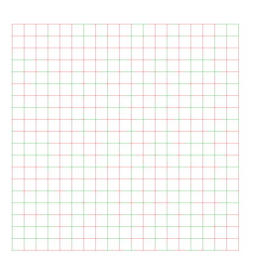
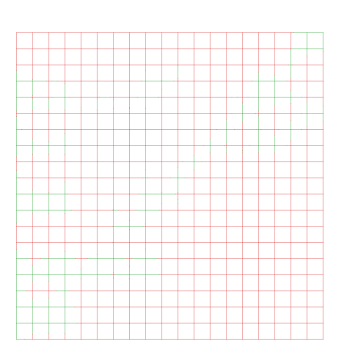
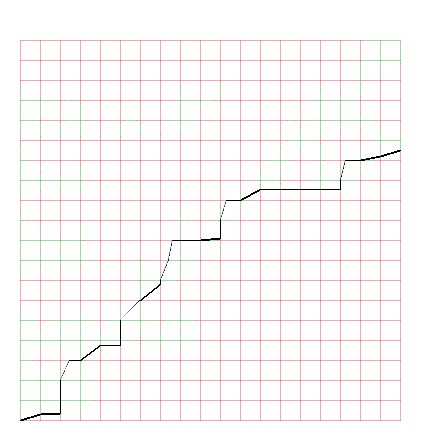

# pcm-rs: Partial Curve Matching with Rust
This code solves the Partial Curve Matching (PCM) Problem:
> Given a curve $P$, a curve $Q$, and a distance threshold $\epsilon$, is there some subcurve $Q' \subset Q$ in such that the Fréchet distance $d_F(P, Q')$ is less than $\epsilon$? 

<!-- Constraints -->
We limit ourselves to polygonal chains, and use the continuous strong Fréchet distance as a (sub)curve similarity/distance measure.\
Furthermore do we assume the points of the curves $P$ and $Q$ to be in general position (thus all points are unique and therefore all points have non-zero pairwise distance).

## Usage
### Python module
To build the python library run the `./build_python_module.sh` script.\
This constructs a "partial_curve_matching.so" file.
Make sure to place this file at where you run the python code from.
Check `main.py` for example usage. 

### Rust binary
In `./pcm_vis/src/main.rs` rust code example of generating test cases, rendering related images, and computing PCM.

## Performance considerations
This code is definitely _not_ optimized (both in terms of complexity and implementation), see [Future work](#future-work-optimizations) for obvious points of improvements.
E.g. all the boundaries of the FSD and RSD is computed, no heuristics are applied, it is single-threaded, vectors are unnecessarily copied all over the place.
The use-case of this code repo is running the BundlePatcher<a href="#bundlepatcher" id="bundlepatcherref"><sup>4</sup></a>, and I only intend to improve in order to make those algorithms run sufficiently fast.

## Algorithm outline
With this context of [Performance Considerations](#performance-considerations) clear, here the algorithm procedure.
It is a three-step process outlined here in the table.

| 1. Compute FSD. | 2. Compute RSD. | 3. Compute path along RSD. |
| --| --|--|
|  |  | |


### Conventions
In the Free-Space Diagram (FSD) we place $P$ on the horizontal axis and $Q$ on the vertical axis. \
This means we have to walk the FSD from left to right. 

Since we are dealing with the partial curve matching, the starting point and end point of $Q$.\
Note: we use the strong Fréchet distance, so we do have to walk monotonically along $P$ _and_ $Q$.

### Problem approach
1. **Construct FSD**. Compute all FSD cell boundaries.
2. **Construct RSD**. 
    1. Initiate the RSD empty. 
    2. Set the left RSD boundary to the left FSD boundary. $(i,j) \in (0,[0,m])$. 
    3. Walk cells from left to right, bottom to top, apply reachability rules.
3. **Construct path**. 
    1. Check for a non-empty boundary on the right RSD boundary (thus a path along $P$ can be constructed).
    2. Start at lowest point on the right RSD boundary and walk left/down until we reach the left RSD boundary.

   
## Algorithm Correctness
This code library lacks a formal proof (both in algorithm and implementation).\
For my use-case I just need some PCM solver which works decently without crazy bugs or errors, so I made some basic visualizations and unit tests to feel assured it does. This in itself already contributed to spotting a significant number of bugs and solving them.

The unit tests consist of:
* If a partial curve match exists (the right border of the RSD is non-empty), expect to find a path in the RSD to walk from left to right. This results in a sequence of points at cell boundaries.
* Expect at every point of that path (no need to interpolate, due to convexity of the RSD cells) to be monotonically increasing _and_ to be within the maximal distance threshold.


## Algorithm considerations
### FSD/RSD cell boundary representation
Each cell boundary is represented with a `OptLineBoundary`:
```rust
// Values a and b are on the unit-interval with a <= b.
struct LineBoundary { a: f64, b: f64 };
type OptLineBoundary = Option<LineBoundary>;
```
Rather than e.g. taking negative values for non-existing values, using `Option<LineBoundary>` is more rust idiomatic.

The structure suffices to construct the FSD/RSD with, because the free space within a cell is guaranteed to be a convex shape:
1. Therefore the free space on a line segment is always empty or a single interval, so we don't have to take gaps into account.
2. While constrained to a monotonically increasing path, we can reach all of the free space on the cell boundary with a single straight line.

We therefore only have to compute cell boundaries, and the free space on a cell boundary can be represented with a single interval.

### Axis-agnostic logic
The core insight here is that _the rules applied on FSD, RSD and path construction are identical irrespective of whether we are at a horizontal or vertical cell boundary_.
Therefore, to minimize code error pitfalls, the construction of the FSD (Free-Space Diagram), RSD (Reachable-Space Diagram), and the extraction of steps is done as much as possible with axis-agnostic logic.

FSD/RSD cell boundaries are stored within a 3D tensor;
```rust
pub struct FSD {
    // ...
    /// Cell boundaries for both axii.
    pub segs : ArrayBase<OwnedRepr<OptLineBoundary>, Dim<[usize; 3]>>,
    // ...
}
```

I found it easier to reason by reflecting the FSD/RSD diagram in the $f: x=y$ line. \
With `axis = 0` we take the perspective of $P$ (placing $Q$ on vertical axis), \
With `axis = 1` we take the perspective of $Q$ (placing $P$ on vertical axis). \
To have axis-agnostic logic the diagram is reflected in the $f: x=y$ line and therefore it makes sense to talk about `(axis,x,y)` positions rather that `(i,j)` indices.

Every FSD cell boundary corresponds with the free space along a point and a line segment. \
The FSD tensor index `(0, i, j)` corresponds to the free space at the cell boundary $p_i, q_j q_{j+1}$ and has a geometric interpretation of a _vertical_ line at `x = i, y = j`.\
The FSD tensor index `(1, j, i)` corresponds to the free space at the cell boundary $q_j, p_i p_{i+1}$ and has a geometric interpretation of a _vertical_ line at `x = j, y = i`.\
Vertical boundaries have a dimensionality of `(n,m-1)` and horizontal boundaries have a dimensionality of `(m, n-1)`.
```rust
let fsd = FSD::empty(n,m);
// Given a cell C_ij, the vertical and horizontal cell boundary segment are at indices:
let vertical   = fsd.segs.slice[(0, i, j)]; // Vertical segment.
let horizontal = fsd.segs[(1, j, i)]; // Horizontal segment.
```

Note: The initiation does differ (is axis specific) in that only the the entire left RSD is initiated with the FSD state (since we may start at arbitrary position along $Q$), and we only require to walk all the way to the right (since we must walk all of $P$ but may end at arbitrary position along $Q$).

### RSD construction rules
todo
### Path construction rules
todo

## Acknowledgement
For detailed information on the FSD and RSD we refer to the original paper by Alt & Godau <a href="#altgodau" id="altgodauref"><sup>1</sup></a>.

Work taken from pyfrechet<a href="#pyfrechet" id="pyfrechetref"><sup>3</sup></a>
* Computing cell boundary.
* Using separate array for horizontal and vertical cell boundaries.

Extended this work by:
* Adjusting reachable-space diagram construction construction for partial curve matching.
* Axis-agnostic functionality/logic to have a more generic + less bug prone code. (usage of 3D tensor instead of two 2D tensors).
* Custom logic to find _some_ path in the reachable space diagram _if_ a partial curve match exists.
* Implementation in Rust 


## Future work (optimizations)
Points of interest to work on:
* [ ] Lazily FSD and RSD construction
* [ ] PCM specific extention to FSD<a href="#maheshwari" id="maheshwariref"><sup>2</sup></a>
* [ ] Multi-threaded
* [ ] SIMD

## References
<a id="altgodau" href="#altgodauref"><sup>1</sup></a> H. Alt and M. Godau, “Computing the Fréchet Distance between Two Polygonal Curves,” Int. J. Comput. Geom. Appl., vol. 05, no. 01n02, pp. 75–91, Mar. 1995, doi: 10.1142/S0218195995000064.\
<a id="maheshwari" href="#maheshwariref"><sup>2</sup></a> A. Maheshwari, J.-R. Sack, K. Shahbaz, and H. Zarrabi-Zadeh, “Improved Algorithms for Partial Curve Matching,” Algorithmica, vol. 69, no. 3, pp. 641–657, Jul. 2014, doi: 10.1007/s00453-013-9758-3.\
<a id="pyfrechet" href="#pyfrechetref"><sup>3</sup></a> https://github.com/compgeomTU/frechetForCurves \
<a id="bundlepatcher" href="#bundlepatcher"><sup>4</sup></a> https://github.com/jvtubergen/geoalg.
